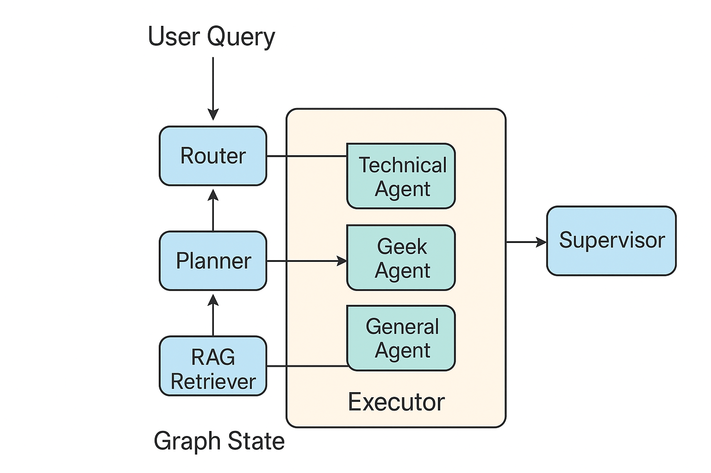

# **Multi-Agentic-System Lab**

## Goal
To design a simplified Multi-Agent System (MAS) that interacts with local or remote LLMs via an OpenAI-compatible API.  
The system is implemented as a **LangGraph**, where **agent-nodes** read, update, and manage the application state using Pydantic models.

---

## Architecture Overview

### Pydantic Models
The core application state is represented using `GraphState` and related Pydantic models:

- **GraphState**: holds the user query, classification, plan, partial answers, final answer, session history, and agent logs.
- **Classification**: type and metadata about the query (`technical`, `geek`, `general`).
- **Plan**: a sequence of executable steps and associated tools.
- **PartialAnswers**: stores intermediate outputs from agents (`rag_context`, `executor_result`, `extra` info).
- **SessionEntry & MemoryNote**: track past queries, answers, and persistent memory notes.

This structured approach ensures **state consistency** and makes agent handoffs explicit.

---

## Agents
### General design of the MAS

1. **Router**
   - Analyzes the query and classifies it into `technical`, `geek`, or `general`.
   - Routes the query to the corresponding processing nodes.

2. **Planner**
   - Generates an executable plan based on the query and classification.
   - Produces a JSON plan with `steps` and `tools` that guides the executor node.

3. **RAG Retriever**
   - Searches memory notes and context relevant to the query.
   - Stores retrieved context in `state.partial_answers.rag_context`.

4. **Technical / Geek / General Agents**
   - LLM-powered agents that execute steps in the plan.
   - Each agent has a different role:
     - **Technical**: answers programming/code queries.
     - **Geek**: answers science, media, and conceptual questions.
     - **General**: handles general-purpose or fallback queries.
   - Each agent updates `state.partial_answers.extra` with its results.

5. **Executor**
   - Iterates through all steps in the plan.
   - Calls the appropriate agent or node for each step.
   - Maintains **handoff logs** and stores intermediate results in `executor_steps` under `state.partial_answers.extra`.
   - Updates `executor_result` after each step.

6. **Formatter**
   - Polishes and rewrites the final answer using an LLM for clarity, conciseness, and style.
   - Updates `state.final_answer` and logs the session.

7. **Supervisor**
   - Performs final safety checks (e.g., blocking forbidden content).

---

## Plan Steps

The planner may generate steps such as:

- `gather_context` → call `rag_retriever_node`
- `ask_technical_agent` → call `technical_agent`
- `ask_geek_agent` → call `geek_agent`
- `ask_general_agent` → call `general_agent`
- `format_answer` → call `formatter_node`

Executor iterates over all steps sequentially, ensuring proper **handoff** between agents.

---

## Usage

### Environment Variables
Set the following environment variables before running:

```bash
OPENAI_API_BASE=<your_api_base>
OPENAI_API_KEY=<your_api_key>
MODEL_NAME=<llm_model_name> # e.g., "qwen"
```

## Running

### Dependencies
Install dependencies via 
```bash
pip install -r requirements.txt
```

### Execution
Run with
```bash
python run.py
```

## Demo

### Example session:
```bash
Input your query (or 'exit'): what does mondai mean in japanese?
**"Mondai" (問題)** in Japanese translates to **"problem," "issue," or "question,"** with nuances shaped by 
context:

1. **Core Meanings**
   - **Problem/Issue**: Describes a difficulty or challenge.
     - *Example*: *Shigoto ni mondai ga aru* (There is a problem at work).
   - **Question/Exercise**: Refers to academic tasks or test questions.
     - *Example*: *Shiken no mondai* (Exam questions).

2. **Kanji Analysis**
   - **問 (Mon)**: "Question" or "inquiry."
   - **題 (Dai)**: "Topic" or "subject."
   - Together, they imply a **"topic requiring resolution"** (e.g., solving a problem or answering a question).

3. **Extended Use**
   - **Puzzle/Challenge**: Applied to riddles or brain teasers.
     - *Example*: *Mondai*... (example incomplete in original text).

This term’s flexibility reflects its role in both practical and intellectual contexts.

--- Agents activated (in order of appearance) ---
router, planner, executor, rag_retriever, general_agent, formatter, supervisor

--- Session history (last entry) ---
Q: how to calculate the sum of 2 numbers in python?
A:

# Adding Two Numbers in Python

Python offers multiple ways to calculate the sum of two numbers. Below are concise, practical methods tailored to common use cases:

---

### **1. Direct Addition**
Add values directly in code:

result = 2 + 3
print("Sum:", result)  # Output: 5


---

### **2. Using Variables**
Assign values to variables for clarity:

a, b = 5, 7
sum_result = a + b
print(f"Sum of {a} and {b} is {sum_result}")  # Output: Sum of 5 and 7 is 12

---

### **3. User Input**
Prompt for dynamic input (supports decimals):

num1 = float(input("Enter first number: "))
num2 = float(input("Enter second number: "))
print(f"Sum: {num1 + num2}")

**Example Output:**

Enter first number: 3.5
Enter second number: 2.5
Sum: 6.0


---

### **4. Reusable Function**
Encapsulate logic in a function for reuse:

def add_numbers(x, y):
    return x + y

print("Sum:", add_numbers(10, 20))  # Output: 30


---

### **Key Notes**
- **Data Types**: Use `int()` for whole numbers; `float()` for decimals.
- **Input Handling**: Always convert string inputs to numeric types before operations.
- **Best Practices**: Functions improve code organization and reusability.

Let me know if you'd like further refinements! 😊
Time: 2025-12-10T12:56:10.683204
(state saved -> state_log_1765371370.json)
```